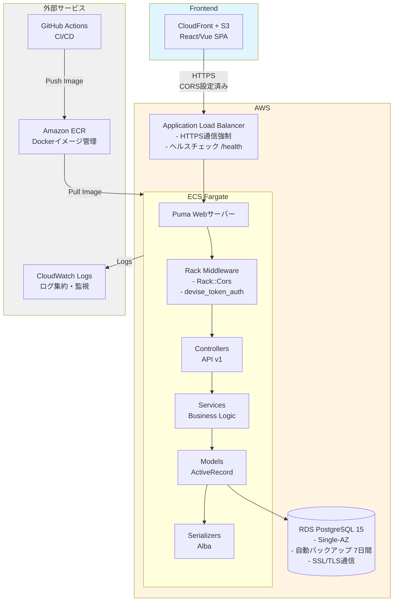

# アーキテクチャ設計書

## 概要

Juku Cloud Backendは、個人経営の学習塾向けクラウド型管理システムのバックエンドAPIです。Ruby on Rails 8.0（API mode）を採用し、RESTful APIを提供します。

**システムの目的:**
- 生徒管理・授業記録・成績追跡の一元化
- 講師の業務効率化
- セキュアな招待システムによる複数講師での共同運営

**このドキュメントのスコープ:**
- バックエンドAPIのアーキテクチャ全体
- レイヤー構造とデータフロー
- 技術スタックとインフラ構成
- セキュリティとパフォーマンス戦略

---

## 既存システムの概要

**プロジェクト:**
- リポジトリ: `juku-cloud-backend`
- フレームワーク: Ruby on Rails 8.0.3 (API mode)
- Ruby: 3.4.4
- データベース: PostgreSQL 15
- 認証: devise_token_auth（トークンベース認証）
- デプロイ: AWS ECS Fargate + RDS

**既存のディレクトリ構造:**
```
app/
├── controllers/     # APIエンドポイント（api/v1配下）
│   └── concerns/    # 共通処理（認証・エラーハンドリング）
├── models/          # ActiveRecordモデル
├── serializers/     # Alba（JSONシリアライザ）
├── services/        # ビジネスロジック（ユースケース実装）
├── queries/         # データベースクエリ（一覧・検索）
├── jobs/            # バックグラウンドジョブ（メール送信・通知）
├── mailers/         # メール送信
└── errors/          # カスタムエラー
```

**新機能の追加方針:**
- 既存のレイヤー構造（Controller → Service → Model）を維持
- サービス層パターンを継続採用
- Queryオブジェクトで複雑なデータ取得を分離
- Albaシリアライザでレスポンス整形を統一

---

## アーキテクチャパターン

**採用パターン:**
- **Rails API モード:** フロントエンドとバックエンドを分離したSPA構成
- **サービス層パターン:** ビジネスロジックをServiceオブジェクトに集約
- **Queryオブジェクトパターン:** 複雑なデータ取得ロジックを分離
- **Result pattern:** Service層の戻り値を統一（成功/失敗を明示）

**レイヤー構成:**
```
Controller → Service → Model → PostgreSQL
    ↓
Serializer: JSONレスポンス整形
Query: 複雑なデータ取得
```

**選定理由:**
- **サービス層パターン:** ビジネスロジックをFat Modelから分離し、テスタビリティと再利用性を向上
- **Queryオブジェクト:** N+1問題の回避と検索ロジックの一元管理
- **API mode:** フロントエンド（React/Vue等）と明確に分離し、将来的なモバイルアプリ対応を容易にする

**拡張方針:**
- 将来的にマイクロサービス化する際も、Service層を境界として分割可能
- 複雑度が増した場合、ドメイン駆動設計（DDD）への移行を検討
- 現時点では過度な抽象化を避け、シンプルなレイヤー構造を維持

---

## システム構成図



**コンポーネント:**
- **Frontend:** React/Vue等のSPA（CloudFront + S3でホスティング）
- **ALB:** HTTPS通信強制、ヘルスチェック、TLS終端
- **ECS Fargate:** コンテナオーケストレーション、Auto Scaling対応
- **Rails API:** Puma（Webサーバー）+ Rails 8.0（API mode）
- **RDS PostgreSQL:** マネージドデータベース、自動バックアップ

**データフロー:**
1. クライアントがHTTPSリクエストをALBに送信
2. ALBがECS FargateのRails APIコンテナにルーティング
3. Rack Middlewareで認証（devise_token_auth）・CORS検証
4. Controllerがリクエストを受付、Serviceを呼び出し
5. ServiceがModelを通じてPostgreSQLにアクセス
6. Serializerがレスポンスを整形し、クライアントに返却

---

## レイヤー構造

### Controller (`app/controllers/api/v1/`)

**役割:** リクエスト受付、認証・認可チェック、Service呼び出し、レスポンス返却

**設計方針:**
- **薄いController:** ビジネスロジックを持たず、Serviceに委譲
- **before_action:** 認証（`authenticate_user!`）、認可（`require_admin_role!`）、School取得（`set_school!`）
- **Strong Parameters:** 許可されたパラメータのみ受け入れ
- **統一されたレスポンス:** Serializerで整形

**実装例:**
```ruby
class Api::V1::StudentsController < ApplicationController
  before_action :authenticate_user!
  before_action :set_school!
  before_action :require_admin_role!, only: %i[create update destroy]

  def index
    students = Students::IndexQuery.call(...)
    render json: Students::IndexResource.new(students).serializable_hash
  end
end
```

---

### Service (`app/services/`)

**役割:** ビジネスロジックの実装、トランザクション管理、複数モデルの操作

**設計方針:**
- **単一責任:** 1つのServiceは1つのユースケースを実装
- **Result pattern:** 成功/失敗を明示的に返す
- **トランザクション管理:** 複数モデルの更新をトランザクションで保護
- **エラーハンドリング:** エラーをキャッチしてログ出力

**命名規則:**
- `*::CreateService`: リソース作成
- `*::Updater`: リソース更新
- `*::Validator`: バリデーション
- `*::TokenGenerate`: トークン生成

**実装例:**
```ruby
class Students::CreateService
  def self.call(school:, create_params:)
    student = school.students.build(create_params)
    student.save!
    student
  end
end
```

---

### Query (`app/queries/`)

**役割:** 複雑なデータ取得、N+1問題回避、検索ロジックの一元管理

**設計方針:**
- **Eager Loading:** `includes`でN+1問題を回避（Bulletで検出）
- **動的な検索条件:** パラメータに応じて条件を組み立て
- **ページネーション:** Kaminariを使用（デフォルト20件/ページ）

**命名規則:**
- `*::IndexQuery`: 一覧取得

**実装例:**
```ruby
class Students::IndexQuery
  def self.call(school:, index_params:, current_user:)
    students = school.students
              .includes(:class_subjects, :available_days, :teachers)
              .page(index_params[:page])
              .per(index_params[:perPage] || 20)
    students = students.where(school_stage: index_params[:school_stage]) if index_params[:school_stage].present?
    students
  end
end
```

---

### Model (`app/models/`)

**役割:** データ永続化、バリデーション、アソシエーション定義

**設計方針:**
- **Thin Model:** ビジネスロジックはServiceに委譲
- **バリデーション:** データ整合性を保証
- **スコープ:** 再利用可能なクエリを定義
- **カスタムバリデーション:** ビジネスルールに基づく検証

**実装例:**
```ruby
class Student < ApplicationRecord
  belongs_to :school
  has_many :student_class_subjects, dependent: :destroy
  has_many :lesson_notes, through: :student_class_subjects

  validates :name, presence: true, length: { maximum: 50 }
  validate :grade_must_be_valid_for_stage
end
```

---

### Serializer (`app/serializers/`)

**使用ライブラリ:** Alba

**役割:** JSONレスポンス整形、機密情報の除外

**設計方針:**
- **必要な情報のみ公開:** パスワード・トークン等の機密情報を除外
- **ネストされたリソース:** 関連リソースを含める
- **条件付き表示:** 状態に応じて属性を出し分け

**命名規則:**
- `*::IndexResource`: 一覧用シリアライザ
- `*::CreateResource`: 作成時レスポンス用
- `*::UpdateResource`: 更新時レスポンス用

---

### Job (`app/jobs/`)

**役割:** 非同期処理、バックグラウンドジョブ

**設計方針:**
- **非同期実行:** メール送信、通知、データ集計等の時間のかかる処理
- **リトライ戦略:** `retry_on`でエラー時のリトライを定義
- **ログ出力:** ジョブの実行状況を追跡

**将来実装予定:**
- レッスンリマインダー送信（前日通知）
- 月次レポート生成（生徒の授業回数・理解度推移）
- データ集計バッチ

---

## エラーハンドリング戦略

### エラーレスポンス形式

**統一フォーマット:**
```json
{
  "status": "error",
  "errors": {
    "field_name": ["error message"]
  }
}
```

または（単一エラー）:
```json
{
  "error": "Error message"
}
```

### エラー処理方針

**ApplicationControllerでの統一処理:**
- `rescue_from ActiveRecord::RecordNotFound` → 404 Not Found
- `rescue_from ActionController::ParameterMissing` → 400 Bad Request
- `rescue_from ActiveRecord::RecordInvalid` → 422 Unprocessable Entity

**カスタムエラー:**
- `app/errors/`にカスタムエラークラスを定義（将来拡張）

**ログ出力:**
- エラー発生時は`Rails.logger.error`で詳細をログ出力
- CloudWatch Logsで集約・監視

---

## 技術スタック

### バックエンド

| カテゴリ | 技術 | バージョン | 用途 |
|---------|------|-----------|------|
| 言語 | Ruby | 3.4.4 | アプリケーション実装 |
| フレームワーク | Rails | 8.0.3 (API mode) | API開発 |
| Webサーバー | Puma | 6.x | HTTPリクエスト処理 |
| データベース | PostgreSQL | 15 | データ永続化 |
| ORM | ActiveRecord | - | データベースアクセス |
| 認証 | devise_token_auth | 1.2.x | トークンベース認証 |
| シリアライザ | Alba | 3.x | JSONレスポンス整形 |
| ページネーション | Kaminari | 1.x | ページング |
| CORS | rack-cors | 2.x | クロスオリジン制御 |
| テスト | RSpec | 3.x | ユニット・統合テスト |
| テストデータ | FactoryBot | 6.x | テストデータ生成 |
| カバレッジ | SimpleCov | 0.22.x | コードカバレッジ計測 |
| コード品質 | RuboCop | 1.x | 静的解析・リント |
| N+1検出 | Bullet | 8.x | N+1クエリ検出 |
| セキュリティ | Brakeman | 6.x | 脆弱性スキャン |

---

### フロントエンド

- **技術:** React/Vue（別リポジトリ: juku-cloud-frontend）
- **ホスティング:** CloudFront + S3
- **通信:** RESTful API（JSON形式）

---

### データベース

- **PostgreSQL 15:** リレーショナルデータベース
- **ActiveRecord ORM:** マイグレーション管理、クエリビルダー
- **接続プール:** 5接続（`RAILS_MAX_THREADS`）
- **SSL通信:** 本番環境では`sslmode=require`

**キャッシュ戦略（将来実装予定）:**
- Rails.cacheで科目一覧・School情報をキャッシュ
- Redisの導入を検討

---

### インフラ

| コンポーネント | サービス | 説明 |
|--------------|---------|------|
| コンピューティング | ECS Fargate | コンテナオーケストレーション |
| データベース | RDS PostgreSQL | マネージドDB（Single-AZ → Multi-AZ移行可能） |
| ロードバランサー | ALB | HTTPS通信強制、ヘルスチェック |
| コンテナレジストリ | ECR | Dockerイメージ管理 |
| CI/CD | GitHub Actions | 自動ビルド・テスト・デプロイ |
| 監視・ログ | CloudWatch Logs | ログ集約、エラー監視 |
| フロントエンド | CloudFront + S3 | 静的ファイル配信 |

---

## データベース設計方針

### スキーマ設計

- **正規化:** 第3正規形を基本とし、パフォーマンス要件に応じて非正規化
  - 例: `lesson_notes`の`created_by_name`は非正規化（参照頻度が高いため）
- **インデックス:** 以下のカラムにインデックスを設定
  - 外部キー（`school_id`, `student_id`, `subject_id`等）
  - 検索対象カラム（`expire_date`, `note_type`等）
  - UNIQUE制約（`invites.token_digest`等）
- **パーティショニング:** 将来的にレコード数が増加した場合、`lesson_notes`のパーティショニングを検討

### マイグレーション

- **Rails標準のマイグレーション使用**
- **運用ルール:**
  - マイグレーション実行前に必ずバックアップ
  - 本番環境へのデプロイ時、ECSタスク定義内で`rails db:migrate`を自動実行
  - ロールバック可能なマイグレーションを心がける

---

## API設計方針

### RESTful設計

- **リソース指向:** `/api/v1/students`, `/api/v1/lesson_notes`
- **HTTPメソッド:** GET（取得）、POST（作成）、PATCH（更新）、DELETE（削除）
- **ステータスコード:**
  - `200 OK`: 成功（GET, PATCH）
  - `201 Created`: リソース作成成功（POST）
  - `204 No Content`: 削除成功（DELETE）
  - `400 Bad Request`: クライアント側エラー
  - `401 Unauthorized`: 認証エラー
  - `403 Forbidden`: 認可エラー（権限不足）
  - `404 Not Found`: リソース不存在
  - `422 Unprocessable Entity`: バリデーションエラー
  - `500 Internal Server Error`: サーバー側エラー

### バージョニング

- **URLバージョニング:** `/api/v1/*`
- **v2への移行計画:** 破壊的変更がある場合、`/api/v2/*`を作成し、v1との並行運用

### エンドポイント一覧

詳細は[functional-design.md](functional-design.md)を参照

---

## セキュリティ

### 認証・認可

- **認証:** devise_token_auth（トークンベース）
  - ヘッダー: `access-token`, `client`, `uid`
  - トークン有効期限: 24時間
  - セッションタイムアウト: 30分無操作
- **認可:** Role-Based Access Control（RBAC）
  - `admin`: 全操作可能
  - `teacher`: 読み取り・作成・更新のみ（削除は不可）
- **アクセス制御:** ユーザーは自分のSchoolのリソースのみアクセス可能（`set_school!`）

### データ保護

- **HTTPS/TLS通信:** ALBでHTTPをHTTPSにリダイレクト
- **パスワードハッシュ化:** bcrypt（cost=12、Railsデフォルト）
- **招待トークン:** HMAC-SHA256でハッシュ化（生トークンはDBに保存しない）
- **機密情報管理:** `.env`ファイル（GitHubに非公開）、AWS Secrets Managerの使用を検討

### その他のセキュリティ対策

- **CORS設定:** rack-corsで許可されたオリジンのみアクセス可能
- **Content Security Policy (CSP):** CloudFrontでCSPヘッダーを設定
- **レート制限:** 将来的にRack::Attackで実装予定
- **Brakeman:** 定期的なセキュリティスキャン（CI/CDで自動実行）
- **Bundler Audit:** 依存ライブラリの脆弱性チェック

---

## スケーラビリティ・可用性

### スケーリング戦略

**水平スケーリング（ECS Fargate）:**
- Auto Scaling設定（CPU使用率70%でスケールアウト）
- 初期: 1タスク → 最大5タスク
- ALBでタスク間の負荷分散

**垂直スケーリング（RDS）:**
- Single-AZ → Multi-AZ移行（将来的に高可用性を確保）
- インスタンスタイプの変更（初期: db.t3.small → db.t3.medium等）

### キャッシング

**将来実装予定:**
- Redis導入（科目一覧、School情報等の頻繁に変更されないデータ）
- Railsのフラグメントキャッシュ（レスポンスの一部をキャッシュ）

### バックアップ

- **RDS自動バックアップ:** 日次（7日間保持）
- **バックアップウィンドウ:** 深夜2-3時（JST）
- **スナップショット:** 重要な変更前に手動スナップショット取得
- **リカバリーテスト:** 月次で復旧手順を検証

---

## 監視・ログ

### 監視

**CloudWatch監視項目:**
- **ECS Fargate:** CPU使用率、メモリ使用率、タスク数
- **RDS:** CPU使用率、接続数、ストレージ使用率
- **ALB:** リクエスト数、レスポンスタイム、エラー率

**アラート設定:**
- CPU使用率 > 80%: 警告
- エラー率 > 1%: 警告
- RDS接続数 > 80: 警告

### ログ

- **Railsログ:** CloudWatch Logsに集約
- **ログレベル:** 本番環境は`info`、開発環境は`debug`
- **ログローテーション:** CloudWatch Logsで自動管理
- **検索:** CloudWatch Logs Insightsでクエリ

### メトリクス

**パフォーマンス計測:**
- APIレスポンスタイム（95パーセンタイル < 200ms）
- データベースクエリ時間（< 100ms）
- N+1クエリ検出（Bulletで開発時に警告）

---

## デプロイメント

### 環境

| 環境 | 構成 | 用途 |
|-----|------|------|
| **開発** | ローカル Docker Compose | 開発・デバッグ |
| **ステージング** | 未構築（将来実装予定） | 本番環境の模擬テスト |
| **本番** | ECS Fargate + RDS | プロダクション環境 |

### デプロイフロー

**GitHub Actions による自動デプロイ:**
1. mainブランチへのpush/マージをトリガー
2. RSpecテスト実行（カバレッジ確認）
3. RuboCop実行（コード品質チェック）
4. Dockerイメージビルド
5. ECRへプッシュ
6. ECSタスク定義更新
7. ECSサービス更新（ローリングアップデート）
8. `rails db:migrate`自動実行

### ロールバック

- **ECSタスク定義のリビジョン管理:** 過去のリビジョンに戻す
- **ECRイメージタグ:** 過去のイメージに戻す
- **データベースマイグレーション:** `rails db:rollback`（慎重に実施）

---

## パフォーマンス要件

### レスポンスタイム

- **APIレスポンスタイム:** 95パーセンタイルで200ms以下
- **データベースクエリ:** 100ms以下
- **バックグラウンドジョブ:** メール送信5秒以内

### スループット

- **同時接続数:** 初期500接続、1年後5,000接続
- **リクエスト処理数:** 100 req/sec（初期）

### リソース使用率

- **CPU使用率:** 平均50%以下、最大70%以下
- **メモリ使用率:** 平均60%以下、最大80%以下
- **データベース接続プール:** 5接続（`RAILS_MAX_THREADS`）

### パフォーマンス最適化方針

1. **N+1問題の回避:** Bulletで検出、`includes`でEager Loading
2. **インデックス設計:** 外部キー・検索対象カラムにインデックス
3. **Queryオブジェクト:** 複雑なクエリを最適化
4. **ページネーション:** Kaminariで大量データを分割取得
5. **キャッシュ戦略:** 将来的にRedisで頻繁に変更されないデータをキャッシュ

---

## 制約事項

### 技術的制約

- **既存技術スタック:** Ruby on Rails 8.0（API mode）、PostgreSQL 15を継続使用
- **認証方式:** devise_token_authを採用（ステートレス認証）
- **インフラ:** AWS ECS Fargate + RDS（Single-AZ、将来Multi-AZ移行可能）
- **デプロイ:** GitHub Actions経由でECR/ECSへ自動デプロイ

### ビジネス制約

- **予算:** 初期開発費用200万円、運用費用月額10万円（AWS料金含む）
- **法規制:** 個人情報保護法への対応が必須
- **ターゲット:** 個人経営〜小規模塾に特化

---

## 設計上の決定事項

| 決定事項 | 選択肢 | 選定理由 | トレードオフ |
|----------|--------|----------|--------------|
| データベース | PostgreSQL | Railsとの相性、実績、フルテキスト検索機能 | MySQLよりメモリ使用量が多い |
| 認証方式 | devise_token_auth | トークンベース（ステートレス）、Railsとの統合が容易 | セッション管理より実装が複雑 |
| シリアライザ | Alba | 高速、シンプルなDSL | ActiveModel::Serializersより機能が少ない |
| インフラ | ECS Fargate | サーバーレス、管理コスト削減 | EC2より単価が高い |
| Single-AZ | RDS Single-AZ | 初期コスト削減 | 可用性がMulti-AZより低い（将来移行予定） |
| 招待トークン | HMAC-SHA256 | 改ざん防止とDB検索性を両立 | bcryptより実装が複雑 |

---

## 将来の拡張性

### 短期（3-6ヶ月）
- 通知機能（メール・プッシュ通知）
- レポート機能（月次レポート、PDFエクスポート）
- 検索機能の強化（全文検索）

### 中期（6-12ヶ月）
- 成績分析ダッシュボード（グラフ表示、苦手分野検出）
- Multi-AZ構成（RDS、ECS）
- Redis導入（キャッシュ戦略）
- ステージング環境構築

### 長期（1年以降）
- 保護者向け機能（保護者アカウント、閲覧権限）
- 複数校舎対応（School階層の導入）
- 決済機能（レッスン料金、請求書発行）
- マイクロサービス化の検討

---

## 参考資料

- [product-requirements.md](product-requirements.md) - プロダクト要求定義書
- [functional-design.md](functional-design.md) - 機能設計書
- [repository-structure.md](repository-structure.md) - リポジトリ構造定義書
- [development-guidelines.md](development-guidelines.md) - 開発ガイドライン
- [Rails Guides](https://guides.rubyonrails.org/) - Rails公式ガイド
- [devise_token_auth Documentation](https://devise-token-auth.gitbook.io/) - 認証ライブラリドキュメント
